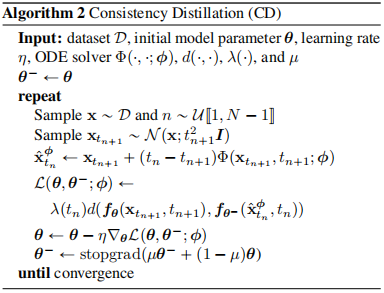
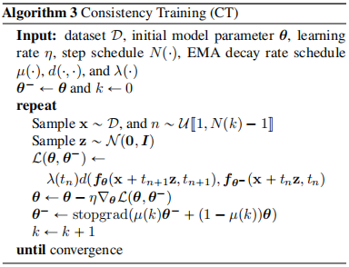

# Consistency Models

## 作者

Yang Song，Prafulla Dhariwal，Mark Chen，Ilya Sutskever

## 刊物

## 解决问题

* 扩散模型依赖迭代生成，导致采样速度变慢

## 创新点

* 在不需要对抗性训练的情况下实现高样本质量
* 支持one-shot生成。也为了样本质量，允许few-shot采样来交换计算
* 支持zero-shot来进行数据编辑
* 可以是扩散模型的预训练模型，也可以作为单独的生成模型
* 我们建议学习一个模型，将任何时间步长的任何点映射到轨迹的起始点。允许我们通过转换随机噪声向量（ODE轨迹的端点）和一个网络评估来生成数据样本。通过在多个时间步长上链接一致性模型的输出，可以提高样本质量，并以更多的计算为代价执行zero-shot数据编辑，类似于对扩散模型所支持的迭代细化。

## 思想概述

* 目标是创建生成模型，促进高效的single-step生成，而不牺牲迭代细化的重要优势
* 建立在连续时间扩散模型（continuous-time diffusion models）的概率流常微分方程（probability flow ordinary differential equation）之上，其轨迹平滑地将数据分布转变为可处理的噪声分布。
* 两种架构：（1）依赖于使用数值ODE求解器和预先训练的扩散模型在PFODE轨迹上生成相邻点对。通过最小化这些对的模型输出之间的差异，我们可以有效地将一个扩散模型提取为一个一致性模型，这允许通过一个网络评估生成高质量的样本；（2）将一致性模型作为一个独立的生成模型家族来定位
  
### 具体做法

根据基于SDE的SMLD和DDPM，我们已经把加噪过程和去噪过程一般化表示为

$$
\begin{cases}
    d\tilde{\bold{x}}(t)=f(\tilde{\bold{x}}(t),t)dt+g(t)dw(t)\\
    d\tilde{\bold{x}}(t)=f(\tilde{\bold{x}}(t),t)-\frac{1}{2}g(t)^2 s_\theta(\tilde{\bold{x}}(t),t) dt
\end{cases}
$$

在一致性模型中，进一步简化，令$f(\tilde{\bold{x}}(t),t)=0$，$g(t)=\sqrt{2t}$。

* 简要思想：我们用PF ODE（去噪过程）生成一条轨迹$\{\bold{x}_t\}_{t\in[\epsilon,T]}$，其中$\epsilon$表示初始时间，也就是没有噪声的那个时刻，至于为什么不是0，是为了数值稳定，不让score function的值过大。然后利用这个轨迹，我们去训练一个一致性函数（consistency function）$f:(\bold{x}_t,t)\mapsto \bold{x}_{\epsilon}$，也就是不论从轨迹的哪个点出发，都能一次映射到初始点，具体定义$f_{\theta}(\bold{x},t)$，即
  
  $$
  f_{\theta}(\bold{x},t)=c_{skip}(t)\bold{x}+c_{out}(t)F_{\theta}(\bold{x},t)
  $$

  其中$c_{skip}(\epsilon)=1$，$c_{out}(\epsilon)=0$。这是一种边界条件的定义，令初始时刻的$f_{\theta}(\bold{x},\epsilon)$只能是$\bold{x}_{\epsilon}$。

* 训练过程分两种，（1）从已经学好的score function蒸馏，也就是Consistency Distillation（CD）；（2）从数据中直接学，把一致性模型当成独立的生成模型，也就是Consistency Training（CT）
* （1）CD：直接用已经训练好的分数函数的来做微调，文中的做法是监督一条轨迹上相邻两个点的模型输出是否一致。
  
  第一步：从$\epsilon$到T之间获取N个时间点，即

  $$
  t_i=(\epsilon^{\frac{1}{\rho}}+\frac{i-1}{N-1}(T^{\frac{1}{\rho}}-\epsilon^{\frac{1}{\rho}}))^\rho
  $$

  第二步：正向采样出$\bold{x}(t_{n+1})$，并利用一阶PF ODE近似估计出$\hat{\bold{x}}_{\phi}(t_n)$，即

  $$
  \hat{\bold{x}}_{\phi}(t_n)=\bold{x}(t_{n+1})-(t_n-t_{n+1})s_{\phi}(\bold{x}(t_{n+1}),t_{n+1})
  $$

  第三步：计算loss

  $$
  \mathcal{L}^N_{CD}(\theta,\theta^-;\phi)=\mathbb{E}_{n\sim\mathcal{U}[1,N-1]}[\lambda(t_n)d(f_\theta(\bold{x}(t_{n+1}),t_{n+1}),f_{\theta^-}(\hat{\bold{x}}_{\phi}(t_n),t_n))]
  $$

  其中$\lambda(t_n)=1$是实验调参试出来的，$d()$可以是L1、L2等计算方法。$\theta^-$是参数$\theta$训练过程中的指数滑动平均（exponential moving average，EMA），不需要进行梯度反向传播更新，更新过程表示为

  $$
  \theta^-\leftarrow stopgrad(\mu \theta^-+(1-\mu)\theta)
  $$

  其中$\mu\in [0,1)$，右边的$\theta^-$是之间训练过程中所有$\theta$的平均。

  

* （2）CT：需要从训练数据中估计得分函数，即
  
  $$
  \nabla logp_t(\bold{x}_t)=-\mathbb{E}[\frac{\bold{x}_t-\bold{x}}{t^2}|\bold{x}_t]
  $$

  可以看出噪声数据$\bold{x}_t\sim\mathcal{N}(\bold{x};t^2I)$

  其他的部分和CD近似，一些细节内容在论文中有详细说明，这里直接给出算法

  

### 总结

我个人理解，一致性模型就是进一步提升了去噪过程的效率，直接从一个噪声图还原回真实图片。无论是DDPM还是SMLD，在去噪时都是需要一步一步的调用score function来去噪，这样势必不如一致性模型的一步到位的方法更有效率。

不得不服宋飏大佬，最开始本来只想通过这一篇论文来理解一致性模型的原理，大不了再看看DDPM，结果发现完全不行，理论不扎实真的弄不明白。从score matching到加噪版，再到加入LD采样，再到SDE统一框架，再到consistency model。整个流程跟下来，我只能说只专计算机一门打遍天下的时代基本已经过去了，想要在这条路上走得更远，基础学科的学习必不可少，其他领域的学习必不可少！尤其是处在这种AI+各领域的大发展趋势下，真的需要扩展眼界和知识面。

## 数据集

## 评价指标

## 结论和实验结果

## 存在问题

## 扩展知识