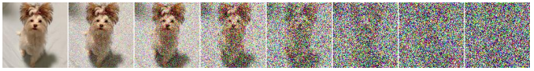
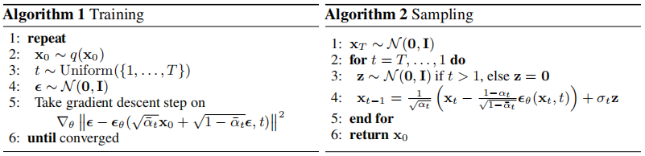

# Denoising Diffusion Probabilistic Models

这篇笔记只关注数学和算法部分，参考论文原文和网上的资料进行总结

## 作者

Jonathan Ho，Ajay Jain，Pieter Abbeel

## 刊物

NeurIPS 2020

## 应用

扩散模型用来做图像去噪和根据文本生成图片。整个模型的训练过程分为两个部分：原始图片的加噪过程和噪声图片的复原过程。最终的目的是希望从一个布满噪声的图中还原出原始图片，在文中称为逆向过程（reverse process），用马尔可夫链表示为

$$
\begin{align*}
    p_\theta(x_{0:T}) &:=p(x_T)\prod^T_{t=1}p_\theta(x_{t-1}|x_t)\\
    p_\theta(x_{t-1}|x_t) &:=\mathcal{N}(x_{t-1};\mu_\theta(x_t,t),\sum_\theta(x_t,t))
\end{align*}
$$

其中$p(x_T)=\mathcal{N}(x_T;0,I)$。上式表示的就是从$x_T$一步步计算出$x_0$的联合概率。但是我们要求的是$x_0$，根据条件概率公式，我们需要知道$p(x_{1:T}|x_0)$才可以。但是这基本上是不可能的，不可能把需要求解的结果作为一个已知条件。那么我们就需要一个一个前向过程（forward process）。这个前向过程就是需要从$x_0$计算出$x_T$，并且每一步都要加入高斯噪声，前向表示为

$$
\begin{align*}
    q(x_{1:T}|x_0) &:=\prod^T_{t=1}q(x_t|x_{t-1})\\
    q(x_t|x_{t-1}) &:=\mathcal{N}(x_t;\sqrt{1-\beta_t}x_{t-1},\beta_t I)
\end{align*}
$$

这样就可以去计算$x_0$了，这个过程使用一个负对数似然函数来表示优化目标

$$
\begin{align*}
    \mathbb{E}[-logp_\theta(x_0)] &\leq \mathbb{E}_q[-log\frac{p_\theta(x_{0:T})}{q(x_{1:T}|x_0)}]\\
    &=\mathbb{E}_q[-logp(x_T)-\sum_{t\geq 1}log\frac{p_\theta(x_{t-1}|x_t)}{q(x_t|x_{t-1})}]\\
    &=:L
\end{align*}
$$

然后进一步表示为KL散度形式，直接是一个前向过程来对比逆向过程

$$
\begin{align*}
    & \mathbb{E}_q[-logp(x_T)-\sum_{t\geq 1}log\frac{p_\theta(x_{t-1}|x_t)}{q(x_t|x_{t-1})}]\\
    =& \mathbb{E}_q[D_{KL}(q(x_T|x_0)||p(x_T))+\sum_{t>1}D_{KL}(q(x_{t-1}|x_t,x_0)||p_\theta (x_{t-1}|x_t))-logp_\theta(x_0|x_1)]
\end{align*}
$$

## 前向加噪过程

加噪过程是每一个时刻t都会加一个噪声z，噪声z是满足高斯分布的。每一时刻的图像$x_t$表示为上一时刻的图像和当前时刻的噪声z的加权求和

$$
x_t=\sqrt{\alpha_t}x_{t-1}+\sqrt{1-\alpha_t}z_1, \alpha_t=1-\beta_t, z_1 \sim \mathcal{N}(0,I)
$$

其中$\beta$需要越来越大，直观的理解就是随着时间的推移，噪声对于图像的干扰程度越来越大，同时上一时刻的图像传递给当前时刻图像的信息会越来越少。可以看出当前时刻的图像$x_t$可以由上一时刻的图像$x_{t-1}$来表示，上一时刻的图像$x_{t-1}$又可以由图像$x_{t-2}$来表示，即

$$
x_{t-1}=\sqrt{\alpha_{t-1}}x_{t-2}+\sqrt{1-\alpha_{t-1}}z_2, \alpha_{t-2}=1-\beta_{t-2}, z_2\sim \mathcal{N}(0,I)
$$

因此可以递归的使用图像$x_{t-2}$来表示当前时刻的图像$x_t$，即

$$
\begin{align*}
x_t &=\sqrt{\alpha_t}(\sqrt{\alpha_{t-1}}x_{t-2}+\sqrt{1-\alpha_{t-1}}z_2)+\sqrt{1-\alpha_t}z_1\\
&=\sqrt{\alpha_t \alpha_{t-1}}x_{t-2}+(\sqrt{\alpha_t(1-\alpha_{t-1})}z_2+\sqrt{1-\alpha_t}z_1)
\end{align*}
$$

令$Z_1=\sqrt{1-\alpha_t}z_1$，$Z_2=\sqrt{\alpha_t(1-\alpha_{t-1})}z_2$，并且$Z_1$和$Z_2$都服从高斯分布，即$Z_1\sim\mathcal{N}(0,1-\alpha_t)$，$Z_2\sim\mathcal{N}(0,\alpha_t(1-\alpha_{t-1}))$。同时$Z_1+Z_2$也服从高斯分布，即$Z_1+Z_2\sim\mathcal{N}(0,(1-\alpha_t \alpha_{t-1})I)$。因此当前时刻图像$x_t$表示为

$$
x_t=\sqrt{\alpha_t \alpha_{t-1}}x_{t-2}+\sqrt{1-\alpha_t \alpha_{t-1}}z_t
$$

同理可以通过递归，用$x_0$来表示当前时刻图像$x_t$，即$x_t=\sqrt{\bar{\alpha}_t}x_0+\sqrt{1-\bar{\alpha}_t}\bar{z}_t$，其中$\bar{\alpha_t}=\prod\alpha_0...\alpha_t$。

## 逆向去噪过程

逆向去噪过程就是通过当前时刻图像$x_t$来求出原始图像$x_0$，其实也就是一个概率分布，已知$x_t$的情况下，求$x_0$的概率$q(x_0|x_t)$。但是并不能直接求出这个概率，需要逆向一步一步的求，也就是先求$q(x_{t-1}|x_t)$，再求$q(x_{t-2}|x_{t-1})$，以此类推。由于前向过程中的$x_t$也是通过原始图像$x_0$得到的，因此这里的$x_t$也是一个条件概率$q(x_t|x_0)$。问题来了，$x_0$是需要求解最终的结果，也就是未知的。我们先放下不管，先给出$q(x_{t-1}|x_t,x_0)$的求解过程，即

$$
q(x_{t-1}|x_t,x_0)=q(x_t|x_{t-1},x_0)\frac{q(x_{t-1}|x_0)}{q(x_t|x_0)}
$$

从前向过程，我们可以得到$q(x_t|x_0)$、$q(x_{t-1}|x_0)$和$q(x_t|x_{t-1},x_0)$的分布，即

$$
\begin{align*}
    q(x_t|x_0)=\sqrt{\bar{\alpha}_t}x_0+\sqrt{1-\bar{\alpha}_t}z &\sim\mathcal{N}(\sqrt{\bar{\alpha}_t}x_0,1-\bar{\alpha}_t)\\
    q(x_{t-1}|x_0)=\sqrt{\bar{\alpha}_{t-1}}x_0+\sqrt{1-\bar{\alpha}_{t-1}}z &\sim\mathcal{N}(\sqrt{\bar{\alpha}_{t-1}}x_0,1-\bar{\alpha}_{t-1})\\
    q(x_t|x_{t-1},x_0)=\sqrt{\alpha_t}x_{t-1}+\sqrt{1-\alpha_t}z &\sim\mathcal{N}(\sqrt{\alpha_t}x_{t-1},1-\alpha_t)
\end{align*}
$$

我们知道高斯分布表示为

$$
exp({-\frac{1}{2}\frac{(x-\mu)^2}{\sigma^2}})
$$

那么$q(x_{t-1}|x_t,x_0)$就可以展开为

$$
\begin{align*}
    q(x_{t-1}|x_t,x_0) &\propto exp(-\frac{1}{2}(\frac{(x_t-\sqrt{\alpha_t}x_{t-1})^2}{1-\alpha_t}+\frac{(x_{t-1}-\sqrt{\bar{\alpha}_{t-1}}x_0)^2}{1-\bar{\alpha}_{t-1}}-\frac{(x_t-\sqrt{\bar{\alpha}_t}x_0)^2}{1-\bar{\alpha}_t}))\\
    &=exp(-\frac{1}{2}((\frac{\alpha_t}{\beta_t}+\frac{1}{1-\bar{\alpha}_{t-1}})x^2_{t-1}-(\frac{2\sqrt{\alpha_t}}{\beta_t}x_t+\frac{2\sqrt{\bar{\alpha}_{t-1}}}{1-\bar{\alpha}_{t-1}}x_0)x_{t-1}+C(x_t,x_0)))
\end{align*}
$$

其中$C(x_t,x_0)$是常数项，因为关心的是和$x_{t-1}$有关的项。由上式可以得到$q(x_{t-1}|x_t,x_0)$分布的均值和方差，即

$$
\begin{align*}
    \sigma^2 &=\frac{\alpha_t}{\beta_t}+\frac{1}{1-\bar{\alpha}_{t-1}}\\
    \mu &= \frac{\sqrt{\alpha_t}(1-\bar{\alpha}_{t-1})}{1-\bar{\alpha}_t}x_t+\frac{\sqrt{\bar{\alpha}_{t-1}}\beta_t}{1-\bar{\alpha}_t}x_0
\end{align*}
$$

现在回到一开始那个问题，$x_0$在逆向去噪过程中是需要求解的结果，在计算过程中并不已知。因此需要替换掉$x_0$，方法是利用正向过程的公式，得到

$$
x_0=\frac{1}{\sqrt{\bar{\alpha}_t}}(x_t-\sqrt{1-\bar{\alpha}_t}z_t)
$$

因此$q(x_{t-1}|x_t,x_0)$分布的均值和方差最终写为

$$
\begin{align*}
    \sigma^2 &=\frac{\alpha_t}{\beta_t}+\frac{1}{1-\bar{\alpha}_{t-1}}\\
    \mu &= \frac{1}{\sqrt{\bar{\alpha}_t}}(x_t-\frac{\beta_t}{\sqrt{1-\bar{\alpha}_t}}z_t)
\end{align*}
$$

此时需要解决的问题是如何获得$z_t$。$z_t$是每一步添加的噪声，我们需要设计一个模型来拟合$z_t$，通过已知条件$x_t$，估计$\tilde{z}_t=model(x_t)$，而标签$z_t$是从前向过程中采样获取的。这个模型使用的是Unet+transformer。

## 算法

### Training

Training就是前向加噪过程，目的就是学习到一个可以拟合出噪声的模型

* 第二步：选择图片的过程
* 第三步：从数列中随机选择一个正整数作为加噪的总步数，可以看到每张图片的总步数都是不一样的
* 第四步：从高斯分布中选择噪声
* 第五步：$\epsilon_\theta$是拟合噪声的模型，也就是Unet模型

### Sampling

Sampling是逆向去噪过程

* 第四步：高斯分布重采样的过程，我们有了$x_{t-1}$的高斯分布，需要从这个分布中采样得到$x_{t-1}$，做法就是
  
  $$
  x_{t-1}=\mu_t+\sigma_t z, z\sim\mathcal{N}(0,I)
  $$