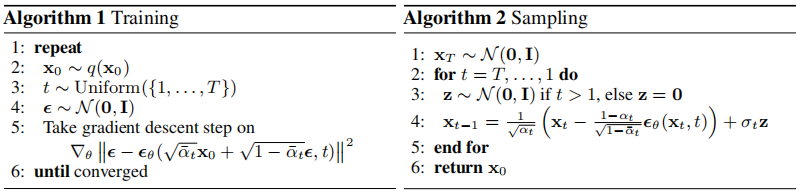

# Stable diffusion复现

## 环境

服务器型号为NVIDIA A16
```
python == 3.8
pytorch == 1.11
torchvision == 0.12.0
einops == 0.6.1
tqdm == 4.46.1
numpy == 1.23.5
```

## 运行命令

```
python main.py
```

## 文件信息

一共包含三个文件夹：config、model、utils。

### config文件夹

包含一个超参数文件config_SD.ini，分三个部分，训练设置、Unet模型设置、扩散模型设置。

```
epochs = 3
batch_size = 10
learning_rate = 0.0001
save_path = /mnt/Unet/pic/test_pic # 测试时，生成图片的保存路径
dataset_path = /mnt/Unet/pic # 数据集的保存路径
input_height = 32 # 由于Unet的上下采样的对应层需要拼接，而维度如果不能被2连
                    续整除，会出现bug，因此这里直接采用最简单的方式解决bug，
                    即改变图片的原始大小
input_width = 32
```

```
channel = 1 # 输入的channel个数，是一个int类型的数值，例如3
model_channels = 64 # 上下采样中CNN的输出channel的基础值，每个上
                      下采样层的channel都在model_channels的基础
                      上加倍，是一个int类型的数值，例如64
num_res_blocks = 1 # 上下采样中每层的残差结构数量，是一个int类型
                     的数值，例如1
attention_resolutions = [1] # 上下采样中第ds*2层是否添加spatial 
                              transformer，是一个set、list或
                              tuple结构，例如[1, 2, 4]
dropout = 0. # dropout率，是一个float类型的数值，例如0.
channel_mult = [1,2,4,8] # 是一个tuple结构，例如(1, 2, 3, 8)，元素个数
                           决定上下采样的层数，元素*model_channels表示
                           每层CNN输出的channel大小
conv_resample = True # 是一个bool类型的数值，例如True。如果是True，
                       那么在每层上下采样时如果最后一个模块不使用残
                       差结构，即resblock_updown=False时，就会使用
                       卷积结构
dims = 2 # 判断使用的卷积结构的维度，是一个int类型的数据，取值是1、
           2、3。例如dims=2时，表示使用的卷积结构是2D
num_classes = 0 # 如果是分类任务，表示类别个数，是一个int类型的数
                  值，例如2或None
num_heads = 8 # transformer的头个数，是一个int值，如果不设置这个参
                数，那么赋值-1。它的优先级低于num_head_channels，
                即划分每个channel时的头维度
num_head_channels = -1 # transformer的头维度，是一个int值，如果不
                         设置这个参数，那么赋值-1。需要注意的是，
                         num_heads和num_head_channels不能同时为
                         -1
use_scale_shift_norm = False # 主要决定残差层的结构，是一个bool类型的
                               数值，例如True
resblock_updown = True # 上下采样中最后一个模块是否需要残差结构，是
                         一个bool类型数据，例如True
transformer_depth = 1 # transformer的堆叠深度，是一个int值，例如1
context_dim = None # spatial transformer中cross attention的context
                     特征维度，是一个int值，例如10
n_embed = 1 # 最后输出时CNN的输出channel个数，是一个int值，例如3
```

```
timesteps = 200 # 扩散过程的时间步
beta_range = [0.0001, 0.02] # 噪声和原始图像的权重
noise_info = [0, 1]
```

### model文件夹

包含Attention.py、Unet.py、DiffusionModel.py。其中DiffusionModel.py复现了Algorithm 1和Algorithm 2两部分，是模型的主体代码，包括diffusion过程和denoising过程。Unet.py是Algorithm 1中噪声预测的部分，并且也是Algorithm 2去噪的关键模块。Attention.py是Unet中SpatialTransformer的部分，如果有其他模态的输入作为context，模型就是Stable Diffusion，如果没有其他模态的输入，SpatialTransformer就是一个自注意力模块。

<p align="center"></p>

#### Attention.py

SpatialTransformer中包括cross attention和基本的basic Transformer模块。在cross attention中，如果没有额外的context embedding输入，那么直接由Image来生成Q、K、V。代码中编写在class CrossAttention(nn.Module)。

<p align="center"></p>

cross attention分别用于SpatialTransformer中Image和context embedding的注意力计算，整个SpatialTransformer模块编写在class BasicTransformerBlock(nn.Module)中。然后根据参数设置对SpatialTransformer进行堆叠，作为完整的SpatialTransformer模块。

<p align="center"></p>

#### Unet.py

在Unet中对原始的Unet做了更改，原始的Unet在每层上下采样中采用的是卷积结构，而在Stable Diffusion中采用残差结构+SpatialTransformer，这样可以增加上下采样中卷积的深度。其中残差结构编写在class ResBlock(TimestepBlock)中，上下采样编写在class Upsample(nn.Module)和class Downsample(nn.Module)中，整体的Unet编写在class UNetModel(nn.Module)中。

<p align="center"></p>

#### DiffusionModel.py

包括Diffusion过程和Denoising过程。Diffusion过程中对输入的图片$x_0$不断加高斯噪声，从$0$时刻开始到$t$时刻结束，得到噪声图片$x_t$，即$x_t=\sqrt{\bar{\alpha}_t}x_0+\sqrt{1-\bar{\alpha}_t}\bar{z}_t$，其中$\bar{\alpha_t}=\prod\alpha_0...\alpha_t$，$\bar{z}_t$是高斯噪声。然后将时间步$t$噪声图片输入Unet模型，计算$t-1$时刻的噪声图片，并和Diffusion过程计算的$t-1$时刻真实噪声图片进行对比，用MSE损失函数计算loss。Diffusion过程和loss计算过程编写在class Diffusion(Diffusion_init)中。

Denoising过程中，使用纯噪声图片作为输入，Unet生成每个时间步$t$的噪声图像，作为$t-1$时刻的噪声图像表示，循环这个过程，直到时刻$0$。最后得到的就是去噪后的图片。Denoising过程没有训练，相当于验证和测试的过程。Denoising过程编写在class Sampling(Diffusion_init)中。

<p align="center"></p>

### utils文件夹

包含params.py和util.py，主要记录的是有关超参数的函数和模型的其他函数。

## 参考文献

包括论文[**High-Resolution Image Synthesis with Latent Diffusion Models**](https://ommer-lab.com/research/latent-diffusion-models/)<br/>和视频[**Stable Diffusion Explained and Demystified with Daniela Dapena**](https://www.youtube.com/watch?v=AQrMWH8aC0Q)<br/>。论文的BibTeX如下

```
@misc{rombach2021highresolution,
      title={High-Resolution Image Synthesis with Latent Diffusion Models}, 
      author={Robin Rombach and Andreas Blattmann and Dominik Lorenz and Patrick Esser and Björn Ommer},
      year={2021},
      eprint={2112.10752},
      archivePrefix={arXiv},
      primaryClass={cs.CV}
}
```