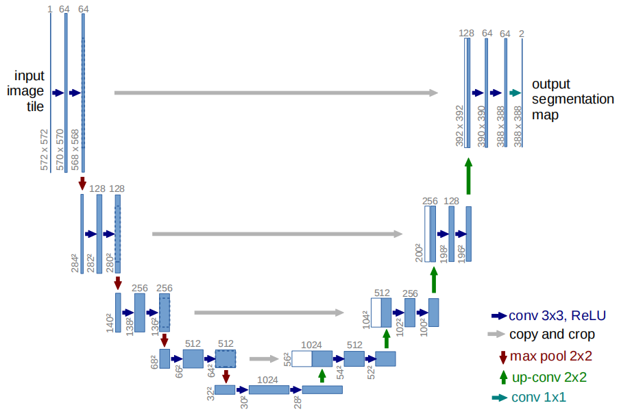
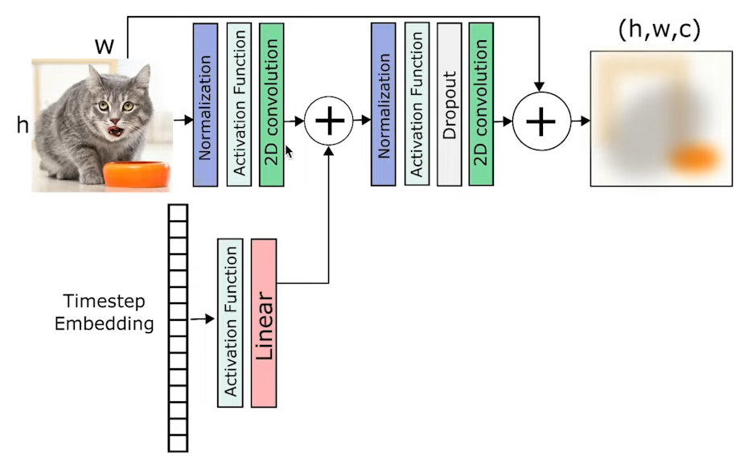
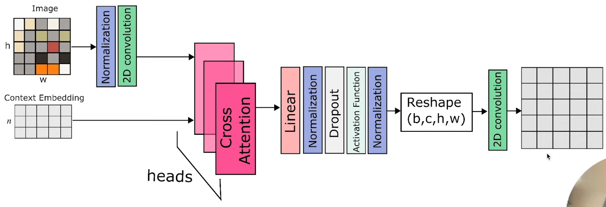

# Unet超简学习笔记

主要包括原始的Unet、DDPM中的Unet和LDM的Unet

## Unet原理[1]

Unet分为两个部分，encoder和decoder。在encoder中，采用的是双卷积（蓝色箭头），并进行4次池化（红色箭头）。接着进行一个双卷积，然后开始四次上采样（绿色箭头），每次采样后进行一次copy and crop（灰色箭头），并进行一次双卷积（蓝色箭头）。

encoder部分就不说了，典型的CNN结构。重点是decoder部分的上采样和skip-connection，目的就是恢复原始的分辨率。上采样采用的是双线性插值。

### 上采样

* 原始图像记为源矩阵（source），插值之后的矩阵记为目标矩阵（target）
  
  $$
  \begin{bmatrix}
    s_{0,0} & s_{0,1} \\
    s_{1,0} & s_{1,1}
  \end{bmatrix}
  $$

  $$
  \begin{bmatrix}
    t_{0,0} & t_{0,1} & t_{0,2} & t_{0,3} \\
    t_{1,0} & t_{1,1} & t_{1,2} & t_{1,3} \\
    t_{2,0} & t_{2,1} & t_{2,2} & t_{2,3} \\
    t_{3,0} & t_{3,1} & t_{3,2} & t_{3,3}
  \end{bmatrix}
  $$

* 首先找出目标矩阵中需要插值的点的坐标到源矩阵坐标的映射
  
  $$
  x_{source}=(x_{target}+0.5)\times(\frac{width_{source}}{width_{target}})-0.5\\
  y_{source}=(y_{target}+0.5)\times(\frac{height_{source}}{height_{target}})-0.5
  $$

  以$t_{0,1}$为例，$x_{target}=0$，$y_{target}=1$，代入公式有$x_{source}=-0.25$，$y_{source}=0.25$

* 然后找到$s_{-0.25,0.25}$周边的四个点，即$s_{-1,0}$，$s_{-1,1}$，$s_{0,0}$，$s_{0,1}$

* 然后根据公式计算双线性插值$t_{0,1}$，即
  
  $$
  \begin{cases}
    t_{0,1}=\frac{y(s_{-1,0})-y(s_{-0.25,0.25})}{y(s_{-1,0})-y(s_{0,0})}s_{-0.25,0}+\frac{y(s_{-0.25,0.25})-y(s_{0,0})}{y(s_{-1,0})-y(s_{0,0})}s_{-0.25,-1}\\
    s_{-0.25,0}=\frac{x(s_{0,1})-x(s_{-0.25,0.25})}{x(s_{0,1})-x(s_{0,0})}s_{0,0}+\frac{x(s_{0,1})-x(s_{-0.25,0.25})}{x(s_{0,1})-x(s_{0,0})}s_{0,1}\\
    s_{-0.25,-1}=\frac{x(s_{0,1})-x(s_{-0.25,0.25})}{x(s_{0,1})-x(s_{0,0})}s_{-1,0}+\frac{x(s_{0,1})-x(s_{-0.25,0.25})}{x(s_{0,1})-x(s_{0,0})}s_{-1,1}
  \end{cases}
  $$

### skip-connection

就是将对应层的特征拼接起来，也就是灰色箭头尾部的特征和头部的特征进行拼接

## DDPM中的Unet[2]

在DDPM中，Unet用来学习噪声函数。和原始的Unet相比，大框架没有变化，仍然是U形结构。但是卷积层采用了残差网络的形式，并加上了时间步。

## LDM中的Unet[3]

在LDM中，Unet在残差结构的基础上，添加了spatial transformer结构，把其他模态的编码和图像编码一同输入到transformer中进行多头cross attention计算。

## 参考文献

[1] Ronneberger O, Fischer P, Brox T. U-net: Convolutional networks for biomedical image segmentation[C]//Medical Image Computing and Computer-Assisted Intervention–MICCAI 2015: 18th International Conference, Munich, Germany, October 5-9, 2015, Proceedings, Part III 18. Springer International Publishing, 2015: 234-241.

[2] Ho J, Jain A, Abbeel P. Denoising diffusion probabilistic models[J]. Advances in Neural Information Processing Systems, 2020, 33: 6840-6851.

[3] Rombach R, Blattmann A, Lorenz D, et al. High-resolution image synthesis with latent diffusion models[C]//Proceedings of the IEEE/CVF Conference on Computer Vision and Pattern Recognition. 2022: 10684-10695.

## 推荐视频

<https://www.youtube.com/watch?v=AQrMWH8aC0Q>
