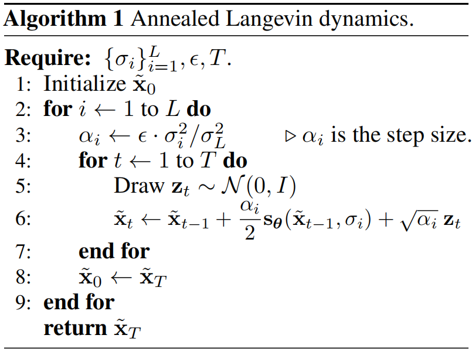

# Score Matching + Langevin Dynamics（SMLD）

## Denoising Score Matching [1]

在上一篇笔记里面，score matching表示为

$$
\begin{align*}
    J_{ESM,p}(\theta)&=\frac{1}{2}\int_{\vec{x}\in \mathbb{R}^n}p(\vec{x})||s_{\theta}(\vec{x})-s(\vec{x})||^2 d\vec{x}\\
    &=\mathbb{E}_{p(\vec{x})}[\frac{1}{2}||s_{\theta}(\vec{x})-s(\vec{x})||^2]
\end{align*}
$$

这是最一开始为了消除归一化因子的score matching，但是$s(\vec{x})$的计算需要$p(\vec{x})$，而这个$p(\vec{x})$又是不知道的值，原始问题中需要求解的结果。因此我们又得到另一个score matching表示形式，即

$$
J_{ISM,p}(\theta)=\mathbb{E}_{p(\vec{x})}[tr(\nabla_{\vec{x}}s_{\theta}(\vec{x}))+\frac{1}{2}||s_{\theta}(\vec{x})||^2_2]
$$

这样就只需要从$s_{\theta}(\vec{x})$上采样就可以计算score function了。但是由于$tr(\nabla_{\vec{x}}s_{\theta}(\vec{x}))$的一些问题，现在的解决方法是对每个数据$\vec{x}$添加噪声，噪声满足概率密度分布$p_{\sigma}(\tilde{\bold{x}}|\bold{x})$（这里开始就把$\vec{x}$写为$\bold{x}$），其中$\sigma$是噪声参数，如果是高斯分布，那么$\sigma^2$就是方差。添加了噪声之后的数据的概率分布就变成

$$
p_{\sigma}(\tilde{\bold{x}})=\int p_{\sigma}(\tilde{\bold{x}}|\bold{x})p(\bold{x})d\bold{x}
$$

因此学习的目标变成了

$$
\begin{align*}
    J_{ESM,p_{\sigma}}(\theta)&=\mathbb{E}_{p_{\sigma}(\tilde{\bold{x}})}[\frac{1}{2}||s_{\theta}(\tilde{\bold{x}})-\frac{\partial logp_{\sigma}(\tilde{\bold{x}})}{\partial \tilde{\bold{x}}}||^2]\\
    &=\mathbb{E}_{p_{\sigma}(\tilde{\bold{x}})}[\frac{1}{2}||s_{\theta}(\tilde{\bold{x}})||^2]-S(\theta)+C
\end{align*}
$$

其中$C=\mathbb{E}_{p_{\sigma}(\tilde{\bold{x}})}[\frac{1}{2}||\frac{\partial logp_{\sigma}(\tilde{\bold{x}})}{\partial \tilde{\bold{x}}}||^2]$不依赖于$\theta$，所以视为一个常数项。对于$S(\theta)$我们展开计算

$$
\begin{align*}
    S(\theta)&=\mathbb{E}_{p_{\sigma}(\tilde{\bold{x}})}[\langle s_{\theta}(\tilde{\bold{x}}),\frac{\partial logp_{\sigma}(\tilde{\bold{x}})}{\partial \tilde{\bold{x}}} \rangle]\\
    &=\int_{\tilde{\bold{x}}}p_{\sigma}(\tilde{\bold{x}})\langle s_{\theta}(\tilde{\bold{x}}),\frac{\partial logp_{\sigma}(\tilde{\bold{x}})}{\partial \tilde{\bold{x}}} \rangle d\tilde{\bold{x}}\\
    &=\int_{\tilde{\bold{x}}}p_{\sigma}(\tilde{\bold{x}})\langle s_{\theta}(\tilde{\bold{x}}),\frac{\frac{\partial}{\partial \tilde{\bold{x}}}p_{\sigma}(\tilde{\bold{x}})}{p_{\sigma}(\tilde{\bold{x}})} \rangle d\tilde{\bold{x}}\\
    &=\int_{\tilde{\bold{x}}}\langle s_{\theta}(\tilde{\bold{x}}),\frac{\partial}{\partial \tilde{\bold{x}}}p_{\sigma}(\tilde{\bold{x}}) \rangle d\tilde{\bold{x}}\\
\end{align*}
$$

然后把$p_{\sigma}(\tilde{\bold{x}})=\int p_{\sigma}(\tilde{\bold{x}}|\bold{x})p(\bold{x})d\bold{x}$带入，有

$$
\begin{align*}
    S(\theta)&=\int_{\tilde{\bold{x}}}\langle s_{\theta}(\tilde{\bold{x}}),\frac{\partial}{\partial \tilde{\bold{x}}}\int_{\bold{x}} p_{\sigma}(\tilde{\bold{x}}|\bold{x})p(\bold{x})d\bold{x} \rangle d\tilde{\bold{x}}\\
    &=\int_{\tilde{\bold{x}}}\langle s_{\theta}(\tilde{\bold{x}}),\int_{\bold{x}} p(\bold{x})\frac{\partial p_{\sigma}(\tilde{\bold{x}}|\bold{x})}{\partial \tilde{\bold{x}}}d\bold{x} \rangle d\tilde{\bold{x}}\\
    &=\int_{\tilde{\bold{x}}}\langle s_{\theta}(\tilde{\bold{x}}),\int_{\bold{x}} p(\bold{x})p_{\sigma}(\tilde{\bold{x}}|\bold{x})\frac{\partial logp_{\sigma}(\tilde{\bold{x}}|\bold{x})}{\partial \tilde{\bold{x}}}d\bold{x} \rangle d\tilde{\bold{x}}\\
    &=\int_{\tilde{\bold{x}}}\int_{\bold{x}}p(\bold{x})p_{\sigma}(\tilde{\bold{x}}|\bold{x})\langle s_{\theta}(\tilde{\bold{x}}),\frac{\partial logp_{\sigma}(\tilde{\bold{x}}|\bold{x})}{\partial \tilde{\bold{x}}} \rangle d\bold{x}d\tilde{\bold{x}}\\
    &=\int_{\tilde{\bold{x}}}\int_{\bold{x}}p_{\sigma}(\tilde{\bold{x}},\bold{x})\langle s_{\theta}(\tilde{\bold{x}}),\frac{\partial logp_{\sigma}(\tilde{\bold{x}}|\bold{x})}{\partial \tilde{\bold{x}}} \rangle d\bold{x}d\tilde{\bold{x}}\\
    &=\mathbb{E}_{p_{\sigma}(\tilde{\bold{x}},\bold{x})}[\langle s_{\theta}(\tilde{\bold{x}}),\frac{\partial logp_{\sigma}(\tilde{\bold{x}}|\bold{x})}{\partial \tilde{\bold{x}}} \rangle]
\end{align*}
$$

将$S(\theta)$带入，有

$$
J_{ESM,p_{\sigma}}(\theta)=\mathbb{E}_{p_{\sigma}(\tilde{\bold{x}})}[\frac{1}{2}||s_{\theta}(\tilde{\bold{x}})||^2]-\mathbb{E}_{p_{\sigma}(\tilde{\bold{x}},\bold{x})}[\langle s_{\theta}(\tilde{\bold{x}}),\frac{\partial logp_{\sigma}(\tilde{\bold{x}}|\bold{x})}{\partial \tilde{\bold{x}}} \rangle]+C
$$

接下来是数学上的小技巧，以我的道行来看，不得不说像是凑出来的，在之前是将$J_{ESM,q_{\sigma}}(\theta)$中的L2范数展开计算出来上面的结果的。那么如果假设有一个不依赖于$\theta$的常数项$C'=\mathbb{E}_{p_{\sigma}(\tilde{\bold{x}},\bold{x})}[\frac{1}{2}||\frac{\partial logp_{\sigma}(\tilde{\bold{x}}|\bold{x})}{\partial \tilde{\bold{x}}}||^2]$，那么我们将$J_{ESM,p_{\sigma}}(\theta)$改写为

$$
J_{p_{\sigma}}(\theta)=\mathbb{E}_{p_{\sigma}(\tilde{\bold{x}})}[\frac{1}{2}||s_{\theta}(\tilde{\bold{x}})||^2]-\mathbb{E}_{p_{\sigma}(\tilde{\bold{x}},\bold{x})}[\langle s_{\theta}(\tilde{\bold{x}}),\frac{\partial logp_{\sigma}(\tilde{\bold{x}}|\bold{x})}{\partial \tilde{\bold{x}}} \rangle]+C'
$$

然后我们反向将L2范数还原，就得到了去噪得分匹配的目标函数，即

$$
\begin{align*}
    J_{DSM,p_{\sigma}}(\theta)&=\mathbb{E}_{p_{\sigma}(\tilde{\bold{x}},\bold{x})}[\frac{1}{2}||s_{\theta}(\tilde{\bold{x}})-\frac{\partial logp_{\sigma}(\tilde{\bold{x}}|\bold{x})}{\partial \tilde{\bold{x}}}||^2]\\
    &=\mathbb{E}_{p_{\sigma}(\tilde{\bold{x}},\bold{x})}[\frac{1}{2}||s_{\theta}(\tilde{\bold{x}})-\nabla_{\tilde{\bold{x}}}logp_{\sigma}(\tilde{\bold{x}}|\bold{x})||^2]
\end{align*}
$$

## SMLD [2]

我们已经有了目标，就是$J_{DSM,p_{\sigma}}(\theta)$，用神经网络可以训练出$s_{\theta}(\tilde{\bold{x}})$。现在需要使用得分函数来取样，也就是生成样本。选择的采样方法是朗之万动力学（Langevin dynamics），朗之万动力学是一种对分子系统动力学进行数学建模的方法，该方法的特点是使用简化模型，同时通过使用随机微分方程来解释省略的自由度。朗之万动力学模拟是一种蒙特卡罗模拟。但是为什么这里选择朗之万动力学，我没有搞明白。也许是它和随机微分方程之间的关系？也有一说是朗之万动力学可以用于从难以直接采样的概率分布中获取随机样本。

采样过程表示为

$$
\tilde{\bold{x}}_t=\tilde{\bold{x}}_{t-1}+\frac{\epsilon}{2}\frac{\partial logp(\tilde{\bold{x}}_{t-1})}{\partial \tilde{\bold{x}}_{t-1}}+\sqrt{\epsilon}z_t
$$

其中$z_t\sim\mathcal{N}(0,I)$是随机项，$\epsilon$是预定义的步长。而在实际中，步长表示为$\alpha_i=\epsilon \frac{\sigma^2_i}{\sigma^2_L}$，其中$\epsilon$是一个常数，$\{\sigma_i\}^L_{i=1}$是一个升序的等比数列。

## 整体流程

### 训练的采样过程

这个采样过程并不是朗之万采样，朗之万采样可以看作是测试过程，而训练采样是在原始的图片上逐步加噪，并取出噪声图片的过程。

* 首先选择一组噪声系数$\{\sigma_i\}^L_{i=1}$，并且满足$\frac{\sigma_1}{\sigma_2}=...=\frac{\sigma_{L-1}}{\sigma_L}>1$
* 按照公式$\tilde{\bold{x}}_i=\bold{x}+\epsilon\sigma_i$，其中$\epsilon\sim\mathcal{N}(0,I)$，因此$p_{\sigma}(\tilde{\bold{x}}|\bold{x})\sim\mathcal{N}(\bold{x},\sigma_i^2 I)$。那么有
  
  $$
  \begin{align*}
    \frac{\partial logp_{\sigma}(\tilde{\bold{x}}|\bold{x})}{\partial \tilde{\bold{x}}}&=\frac{\partial log\frac{1}{\sqrt{2\pi\sigma_i}}e^{-\frac{(\tilde{\bold{x}}-\bold{x})^2}{2\sigma_i^2}}}{\partial\tilde{\bold{x}}}\\
    &=-\frac{\tilde{\bold{x}}-\bold{x}}{\sigma_i^2}
  \end{align*}
  $$

### 训练过程

* 首先获取针对$\sigma_i$的损失函数，即
  
  $$
  l(\theta;\sigma_i)=\frac{1}{2}\mathbb{E}_{p_{data},\tilde{\bold{x}}\sim\mathcal{N}(\bold{x},\sigma_i^2 I)}[||s_{\theta}(\tilde{\bold{x}},\sigma)+\frac{\tilde{\bold{x}}-\bold{x}}{\sigma_i^2}||^2]
  $$

* 然后获取联合损失函数，即
  
  $$
  L(\theta;\{\sigma_i\}^L_{i=1})=\frac{1}{L}\sum_{i=1}^L \lambda(\sigma_i)l(\theta;\sigma_i)
  $$

  其中$\lambda(\sigma_i)$表示不同噪声级别的权重。

### 测试过程

测试过程就是去噪过程，用的就是退火朗之万动力学，不重复复述过程了。但是重要的一点就是，从退火朗之万动力学的公式来看，怎么都像在加噪，和扩散模型完全不一样。这就是有意思的地方，在训练的时候，可以看到我们想要拟合出来的$s_{\theta}(\tilde{\bold{x}})$是一个负数，也就是$-\frac{\tilde{\bold{x}}-\bold{x}}{\sigma_i^2}$，因此退火过程其实和扩散模型的去噪过程是一样的，都是加噪的逆过程。

## 参考文献

[1] Vincent P. A connection between score matching and denoising autoencoders[J]. Neural computation, 2011, 23(7): 1661-1674.

[2] Song Y, Ermon S. Generative modeling by estimating gradients of the data distribution[J]. Advances in neural information processing systems, 2019, 32.